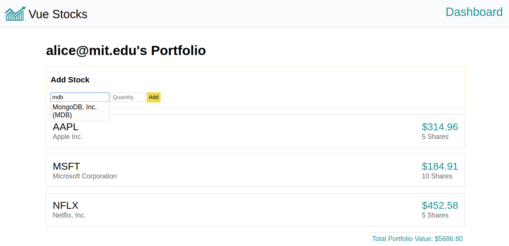

# react-shopping-cart

A lightweight Vue stock portfolio app with server-side rendering.

## Setup

1. Make sure you have MongoDB running locally on port 27017. Or modify the `mongodbUri` in `config.js` with your MongoDB connection string.
2. `npm install`
3. `npm run seed` to seed your local database. Note that this will delete a few collections in the `test` database by default.
4. `npm run local`
5. Go to `http://localhost:3000`

## Testing

Run `npm test` to run the tests in `test/e2e.test.js`. The tests use Puppeteer
to test the app end to end.

Run `env D=1 npm test` to run the tests in "debug mode" - show the actual
browser windows the tests are running in, and leave the browser windows
open after the test is done.